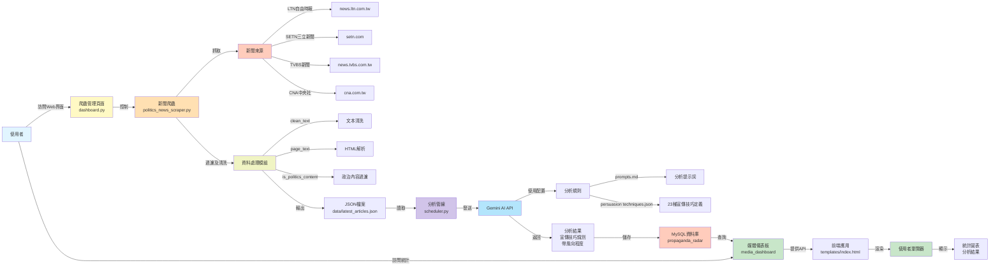
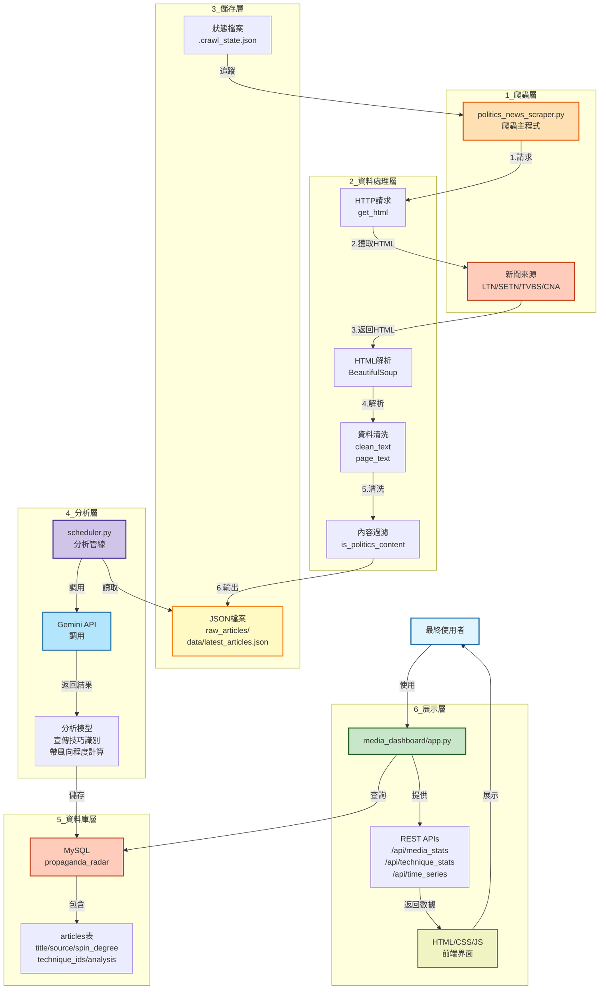
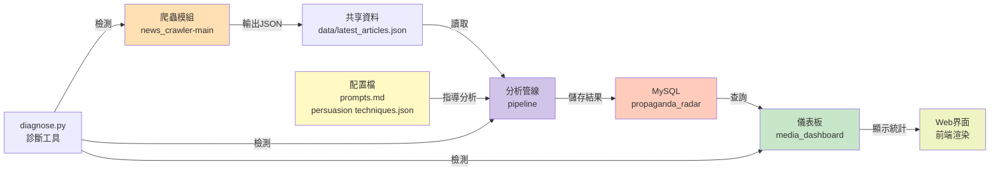
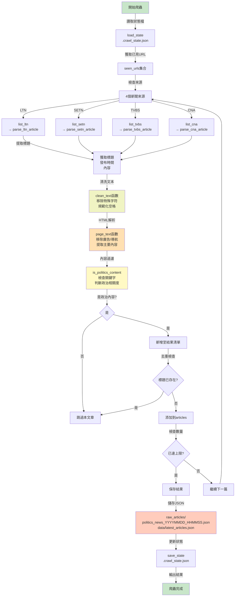
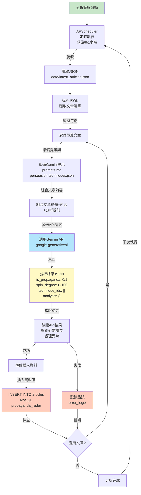
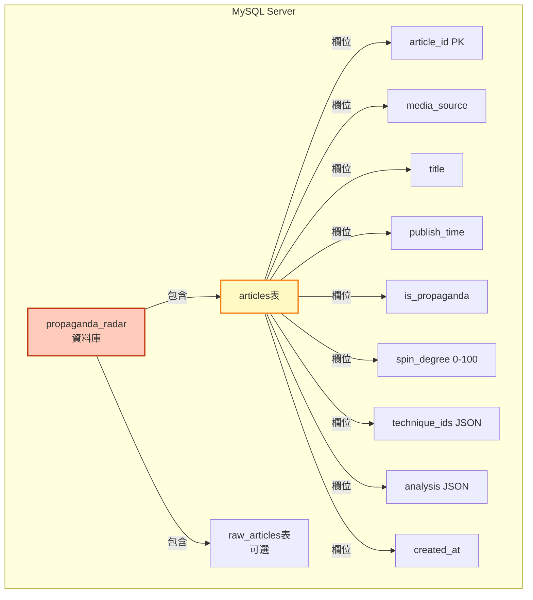
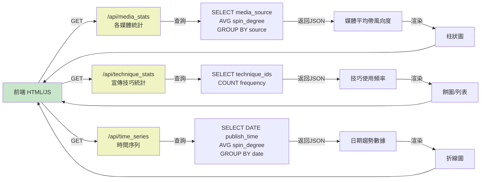
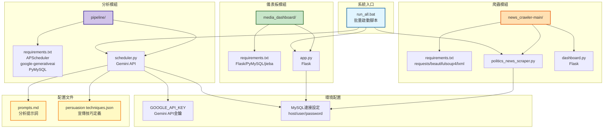
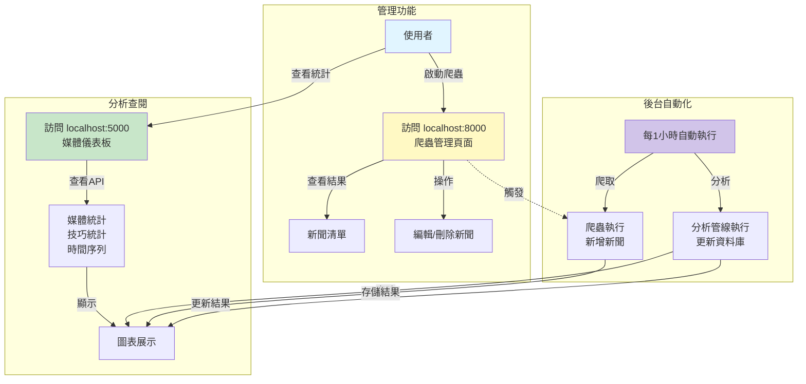

# 新聞政治宣傳監測系統 - 系統架構圖

## 完整系統架構



---

## 資料流動詳細圖



---

## 系統模組關係圖



---

## 爬蟲工作流程詳細圖



---

## 分析管線工作流程圖



---

## 資料庫層次結構



---

## 前端API調用圖



---

## 系統配置依賴關係



---

## 使用者交互流程



---

## 資訊流完整圖表

```
上層應用層
    ↓
使用者界面層 ← 前端 (HTML/CSS/JS) ← 媒體儀表板 (media_dashboard)
    ↓
API層 ← Flask REST APIs (/api/media_stats, /api/technique_stats, /api/time_series)
    ↓
資料查詢層 ← MySQL Query (SELECT...)
    ↓
資料持久化層 ← MySQL Database (propaganda_radar)
    ↓
分析處理層 ← scheduler.py + Gemini API ← 分析結果 (is_propaganda, spin_degree, technique_ids)
    ↓
JSON資料層 ← data/latest_articles.json ← 爬蟲輸出
    ↓
資料提取層 ← politics_news_scraper.py ← HTTP請求 + HTML解析 + 文本清洗 + 內容過濾
    ↓
資料來源層 ← 外部新聞網站 (LTN/SETN/TVBS/CNA)
    ↓
互聯網層 ← 全球新聞內容
```

---

## 系統組件說明表

| 組件 | 功能 | 技術棧 | 輸入 | 輸出 |
|------|------|--------|------|------|
| **politics_news_scraper.py** | 爬取政治新聞 | requests, BeautifulSoup, lxml | 網站URL | JSON檔案 |
| **dashboard.py** | 爬蟲管理界面 | Flask | 使用者操作 | HTML頁面 |
| **scheduler.py** | 自動分析管線 | APScheduler, Gemini API, PyMySQL | JSON檔案 | MySQL記錄 |
| **app.py (media_dashboard)** | 統計儀表板 | Flask, PyMySQL, jieba | MySQL查詢 | REST API |
| **prompts.md** | AI分析提示 | 文本 | (配置檔) | AI指導 |
| **persuasion techniques.json** | 宣傳技巧定義 | JSON | (配置檔) | 分析規則 |
| **MySQL資料庫** | 資料持久化 | MySQL | INSERT/SELECT | 記錄集合 |

---

**系統架構圖版本**: 1.0  
**最後更新**: 2026年6月2日
